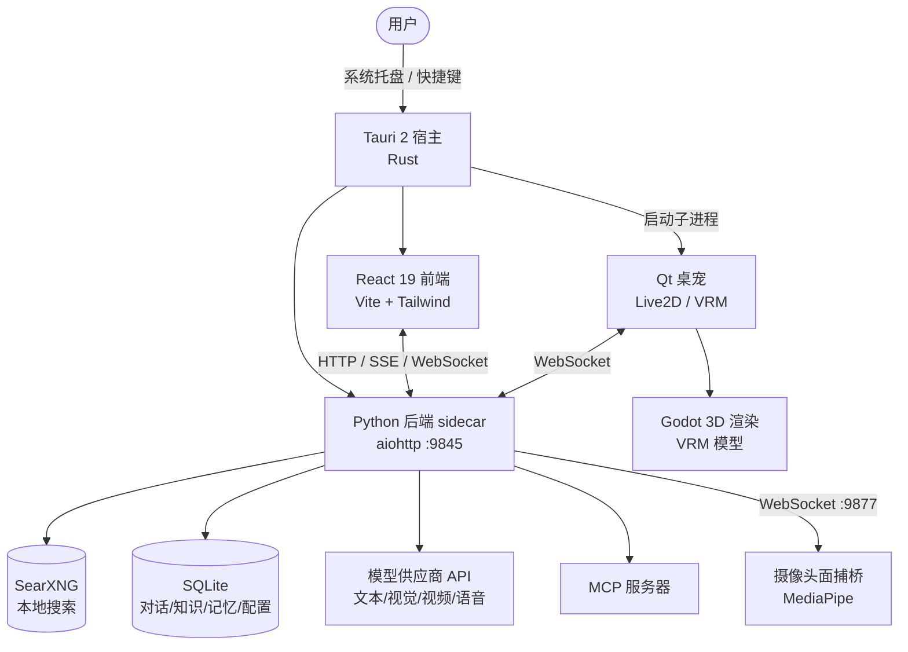

# 奶昔 · 桌面智能体 (Naixi Desktop)

[English](README_EN.md) | 简体中文

[](https://github.com/Hayliy/naixi-desktop/actions/workflows/ci.yml)


> 一款**本地优先**的桌面 AI 智能体。基于 Tauri 2 构建，常驻系统托盘，把「对话、桌宠、直播互动、工作流、自动化、本地搜索、知识库、记忆」整合进一个随开随用的桌面应用。所有 AI 推理所需的模型调用、本地搜索、语音处理都在本机或你自己的账号下完成，**数据留在本地**。

**项目规模**：第一方代码约 **4.8 万行**（Python 33,508 / 前端 14,208 / Rust 467）· **52** 个 Python 模块 · **35** 个前端组件 · **176** 个 REST API · **27** 张 SQLite 表 · **502** 次提交 · Apache-2.0

- 宿主：Tauri 2（Rust）+ 系统托盘常驻
- 前端：React 19 + Vite + Tailwind CSS
- 后端：Python sidecar（aiohttp，默认 `http://127.0.0.1:9845`）
- 桌宠：PySide6（Qt）驱动 Live2D / VRM 形象，支持摄像头面捕
- 搜索：内置 SearXNG 便携版，可降级到公共引擎

## 界面一览

桌面端的几个核心视图（更详细的功能拆解见 [功能一览](#功能一览)）：

<table>
  <tr>
    <td width="50%"><br><sub><b>桌宠 · 直播互动</b> — Qt + Live2D 看板娘 + 弹幕 / 场景 / Agent 调度</sub></td>
    <td width="50%"><br><sub><b>仪表盘</b> — 工具 / 记忆 / 供应商 / 数据库 / 系统资源一屏概览</sub></td>
  </tr>
  <tr>
    <td width="50%"><br><sub><b>可视化工作流</b> — DAG 节点拖拽，25 种节点 · 含 LLM / 条件 / 人工输入</sub></td>
    <td width="50%"><br><sub><b>19 平台接入</b> — QQ / 微信 / 飞书 / 钉钉 / 公众号 / Telegram / Discord / Slack / LINE…</sub></td>
  </tr>
  <tr>
    <td width="50%"><br><sub><b>智能对话</b> — 流式 / Agent / 快捷问答 / 工具调用可观测</sub></td>
    <td width="50%"><br><sub><b>分层记忆系统</b> — 短期上下文 + 长期画像 + 反思提炼</sub></td>
  </tr>
  <tr>
    <td width="50%"><br><sub><b>自动化</b> — 定时 / Webhook / 工作流触发，零人工干预</sub></td>
    <td width="50%"><br><sub><b>运维与自检</b> — 健康评分 / 可用率 / 评分趋势 / 巡检处置</sub></td>
  </tr>
</table>

---

## 目录

- [工程亮点](#工程亮点)（想快速判断技术含量，先看这节）
- [功能一览](#功能一览)
- [技术架构](#技术架构)
- [目录结构](#目录结构)
- [快速开始](#快速开始安装包)
- [升级与卸载](#升级与卸载)
- [从源码构建](#从源码构建)
- [开发者上手（贡献指南）](#开发者上手贡献指南)
- [资源自备说明](#资源自备说明)
- [配置](#配置)
- [已知问题 / 限制](#已知问题--限制)
- [版本与兼容性承诺](#版本与兼容性承诺)
- [常见问题](#常见问题faq)
- [故障排查手册](#故障排查手册)
- [安全与完整性](#安全与完整性)
- [风险与合规声明](#风险与合规声明)
- [赞助支持](#赞助支持)
- [许可证](#许可证)

---

## 工程亮点

1. **双进程解耦架构**：Tauri 2（Rust）宿主只负责窗口、托盘与子进程生命周期；Python sidecar 承载全部 AI 能力。Rust 侧实现端口预检、进程树回收与 embed 运行时定位，前后端可独立热更新、异常自愈。
2. **四级渲染后端抽象**：一个 `AvatarBackend` 接口（`send_expression` / `send_motion` / `send_parameters`）统一自研 Live2D、VTube Studio 连接池、VMC 协议 OSC、插件扩展四种实现，同时驱动 Live2D / VRM / Pixi.js 三套管线与 Godot 3D 渲染。
3. **系统级 Windows 疑难攻克**：透明置顶悬浮窗 + `WM_NCHITTEST` 像素级鼠标穿透；解决 DWM 合成层导致对话框不可见的问题（18 轮真机迭代，可见率 0.8172 一次通过）。
4. **LLM 应用工程**：按任务类型（文本 / 视觉 / 视频 / 代码 / 语音）路由模型并遵守并发上限；分层记忆 + 三级上下文压缩 + 46 处工具调用 + MCP 客户端；TTS 三层故障转移（CosyVoice → Edge-TTS → 离线 kokoro-onnx）。
5. **游戏操控 Agent（Cradle 范式）**：截图输入 + 键鼠输出，不读游戏内存、不连服务器，只操控用户自己的当前窗口；含执行后反思纠偏（帧差判断卡墙并强制脱困）。
6. **用户态安全前哨**：银狐木马应急防护（IOC 哨兵扫描 / 一键急救 / 安装包 SHA-256 自检 / 周期巡检），并**明确公示能力边界**——不处理内核级 rootkit，不做安全误导。

---

## 功能一览

### 1. 智能对话与多模型路由
- 流式对话（`/api/chat/stream`）与 Agent 对话（`/api/agent/stream`），支持中途取消（`/api/chat/cancel`）。
- 多模型路由：按任务类型（文本 / 视觉 / 视频 / 代码 / 语音）自动选择供应商与模型，并遵守各模型的并发上限。
- 对话历史本地留存，可按会话检索、删除单条消息。
- 多模态生成：文生图（`/api/generate_image`）、文生视频（`/api/generate_video`）、文生语音（`/api/generate_voice`）、代码生成（`/api/generate_code`）。

### 2. 桌宠（PetWindow）
- Qt 桌宠本体，支持 Live2D 与 VRM 两种形象；右键菜单可切换动作、表情、开发者模式、摄像头面捕等。
- **动作 / Idle 引擎**：内置多组鲜活动作与默认 idle 循环（歪头、头发飘动、身体浮动等），可在菜单勾选启用。
- **摄像头面捕**：基于 MediaPipe FaceLandmarker 离线检测，驱动 VRM 表情与头部姿态、Live2D 口型；默认关闭，仅从右键菜单开启。
- **3D 渲染适配器（AvatarBackend）**：统一 `send_expression / send_motion / send_parameters` 接口，按角色绑定后端：
  - `self`（自研 Live2D 渲染，默认）+ `vts`（VTube Studio 多实例连接池）+ `vmc`（VMC 协议 OSC/UDP，可驱动 VSeeFace / Warudo / VMagicMirror 等）。
- **多角色舞台（StageWindow）**：Pixi 加载 N 个 Live2D 精灵，消息按 `agent_id` 路由到对应角色，支持独立模型下拉、独立表情/动作/口型。

### 3. 直播互动引擎（Live2D / VRM）
- 弹幕接入、语音播报、麦克风上麦（真人语音闭环：ASR → 自动上麦）、场景切换、直播测试。
- VTube Studio 多实例同框（每角色独立端口），VTS 全局热键管理（`/api/hotkeys`）。
- QQ 多智能体接入状态（`/api/napcat/status`）、连接凭证一键获取（`/api/live/connect_credentials`）。
- 直播记忆层：角色能记住观众画像与事件流（`/api/live/memory`），用于更有连续性的互动。

### 4. 语音
- **语音输入**：麦克风采集 + VAD（WebRTC/能量门控）+ ASR（云端与本地双通道），可在设置中切换。
- **语音输出（TTS）**：统一路由（CosyVoice 主 + Edge-TTS 兜底 + 故障转移），客户端本体播放；可一键配置 VoiceMeeter 虚拟音频路由。
- 音频设备枚举、直播 TTS 测试。

### 5. 知识库
- 本地知识条目增删改查与语义搜索（`/api/knowledge/*`）。
- 支持从 GitHub 仓库、网页 URL 批量导入，自动摘要与切片入库。

### 6. 记忆系统
- 对话内容分层检索（`/api/memory/*`）：短期上下文 + 长期记忆画像（观众/用户画像、近期事件流）。
- 反思模块（`reflection.py`）周期性提炼长期记忆，供对话与直播复用。

### 7. 资源库（专家 / 技能 / 提示词）
- 内置专家、技能、提示词数据（随包分发，开箱即用）。
- 提示词管理（`/api/prompts`）：本地保存/删除，或从 GitHub 拉取社区提示词、专家、技能（`/api/github/*`）。
- 自定义资源（`/api/custom/*`）：用户自建提示词/专家/技能。

### 8. 工作流
- 可视化工作流编辑器（`WorkflowEditor`），丰富节点类型（`/api/workflow/node-types`）。
- 保存 / 运行 / 导出 / 导入 / 发布；支持 Webhook 触发（`/api/webhook/{endpoint}`）、版本管理、人工输入节点。
- 发布为对外服务：API Key 管理（`/api/workflows/{id}/keys`）、用量统计、GitHub 模板市场（在线/本地模板）。

### 9. 自动化
- 定时与事件触发的自动化任务（`/api/automations/*`）：保存、开关、运行、删除、Webhook 触发。
- 可编排多步操作（调用工具、对话、工作流等），无需手动干预。

### 10. 运维与自检
- 运维面板（`/api/ops/*`）：实例自检（inspect）、自修复（self-heal）、事件（incidents）、维护模式、变更日志、健康检查历史与趋势。
- 启动看门狗自动拉起离线服务（SearXNG 等）。
- 任务管理（`/api/tasks`）、运行日志（`/api/logs`）、前端运行时错误自动上报（`/api/client-error`）。

### 11. 工具与 MCP
- 工具权限确认机制（`/api/tools`、`/api/tool/permit`）：Agent 调用敏感工具前需用户授权。
- MCP 服务器管理（`/api/mcp/*`）：添加、连接、断开、测试；启动自动连接已配置服务器。

### 12. 游戏 Agent（看屏操控）
- 思路：截图输入 + 键鼠输出，**不读取游戏内部内存**，像真人一样操控用户自己的游戏窗口（单机 / 当前窗口）。
- 支持场景：Minecraft（只读 MOD 注入 + 视觉 grounding）、Mindustry（看屏决策）、扫雷（视觉 grounding 实验）。
- 组件：`game_agent.py`、`game_agent_mindustry.py`、`ui_grounding.py`（UI 定位）、`semantic_grounding.py`（语义理解）、`mc_bridge.cjs` / `mc_observer.cjs`（Minecraft 桥接）、`mc_readonly_mod`（只读 MOD）。

### 13. 安全中心（银狐应急防护）

针对银狐（Silver Fox / 游蛇 / Void Arachne）类木马的本机用户态前哨，入口：设置 → 安全。

- **应急哨兵扫描**（`GET /api/security_scan`）：检测用户态可见痕迹——① Defender 排除项被篡改（银狐常把 C:–F: 加进排除列表致盲杀软）；② 已知 IOC 进程名；③ 可疑计划任务（`DesignAccent` / `Accent` / `zpaq` 等 Silver Fox 命名）；④ 到已知 C2 网段的外连。返回 safe / warn / danger 三级与逐条明细。
- **一键急救**（`POST /api/security_remediate`）：移除已检出的用户态痕迹——结束 IOC 进程、删除可疑计划任务、恢复被篡改的 Defender 整盘排除项。**安全约束**：仅处理服务端 IOC 目录内的已知项，绝不接受客户端传来的任意路径/命令；所有动作服务端权威重算。
- **360 系统急救箱**：调用官方正版工具，补用户态以外的内核/rootkit 级强杀能力。
- **安装包完整性自检**（`GET /api/self_hash`）：展示本机主程序 `naixi-desktop.exe` 的 SHA-256，可一键复制，供与官方 `sha256sums.txt` 的「主程序」段人工比对。
- **自动监测哨兵**：后台周期性巡检，命中异常时告警。

> **能力边界（重要）**：银狐最新变种用 BYOVD 加载 `wnBios` 内核级 rootkit，能直接读写物理内存、致盲 Defender / 火绒 / 360。这种**内核层**的东西任何**用户态程序（含奶昔）都杀不掉**，必须靠专业杀软 + 安全模式全盘查杀。奶昔只处理**用户态可见痕迹**，UI 已写明，不做能力误导；也**绝不内置任何反制 C2 的能力**（对 C2 发起 DoS / 未授权访问既违法也无效）。

---

## 技术架构



**关键进程**
- **主应用（Tauri）**：负责窗口、托盘、安装、拉起后端与桌宠子进程。
- **后端（Python）**：所有 AI 能力、搜索、知识库、工作流、运维的统一服务端。
- **桌宠（Qt）**：可选的 Live2D / VRM 形象进程，经 WebSocket 与后端通信。
- **面捕桥**：摄像头视频流 → MediaPipe 检测 → 姿态/表情数据，独立端口。

---

## 目录结构

```
naixi-desktop/
├── src/                     # 前端 React 代码（页面、组件、公共库）
│   ├── components/          # Dashboard / Chat / KnowledgePanel / WorkflowEditor
│   │                       # AutomationPanel / PetWindow / StageWindow / SettingsPage ...
│   ├── lib/                 # 流式请求、avatar 驱动等公共库
│   └── ...
├── src-tauri/               # Rust 宿主、Tauri 配置、NSIS 安装脚本
│   ├── src/                 # Rust 命令与启动流程
│   ├── installer/           # NSIS 向导（横幅、四步向导）
│   └── resources/           # 打包资源（自包含 Python 运行时，不入库）
├── desktop_core/            # Python 后端（sidecar）
│   ├── api.py               # aiohttp 路由注册（所有 /api/* 端点）
│   ├── pet_window.py        # Qt 桌宠主窗
│   ├── vrm_pet.py           # VRM 3D 渲染
│   ├── face_bridge.py       # 摄像头面捕桥
│   ├── voice_input.py / tts_router.py   # 语音输入 / 输出
│   ├── workflow_engine.py / ops_engine.py / orchestrator.py
│   ├── memory*.py / storage.py / reflection.py   # 记忆与存储
│   ├── mcp_client.py / tools.py      # 工具与 MCP
│   ├── live_engine.py / avatar_backends.py  # 直播与渲染后端
│   ├── game_agent*.py / *grounding.py / mc_*.cjs  # 游戏 Agent
│   └── vrm_html/           # 面捕前端资源（index.html / MediaPipe vendor）
├── godot_renderer/          # Godot 3D 渲染工程（.vrm 模型不入库）
├── scripts/                 # 构建 / 打包辅助脚本
├── public/                  # 前端静态资源（logo 等）
├── data/                    # 运行时用户数据（不入库）
├── searxng/                 # 内置 SearXNG 实例（不入库，构建时附加）
├── CHANGELOG.md             # 版本历史
├── NOTICE                   # 第三方组件许可证
└── LICENSE                  # Apache 2.0
```

---

## 快速开始（安装包）

1. 到 [Releases](../../releases) 下载 `naixi-desktop_0.2.10_x64-setup.exe`
2. 运行安装程序，按向导完成安装（含 WebView2 运行时自动安装）
3. 从开始菜单或桌面快捷方式启动「奶昔」

> 离线环境若 WebView2 缺失，安装程序会给出中文手动安装提示。

---

## 升级与卸载

**升级**：从 [Releases](../../releases) 下载新版安装包，直接运行即可覆盖升级，**无需先卸载**。升级不要求重新配置模型供应商；你的对话、知识库、记忆等数据保存在安装目录的 `data/` 下，覆盖安装不针对用户数据做格式化。**升级前建议手动复制一份 `data/` 目录**（内含 SQLite 数据库）以防万一——数据无价，备份永远不亏。

**卸载**：Windows 设置 → 应用 → 找到「奶昔」→ 卸载。注意：卸载程序移除的是程序本体；安装目录下的 `data/`（对话记录、知识库、长期记忆、Fernet 加密的 API Key）可能残留，**如需彻底清除请手动删除整个安装目录**。API Key 即使残留也是加密落盘的，但仍建议彻底删除。

---

## 从源码构建

环境要求：
- Windows 10 或更高版本
- Node.js 22+ 与 Rust 工具链（cargo）
- Python 3.13（构建脚本会自动处理运行时打包）

```bash
npm install
npm run tauri build --bundles nsis
```

构建产物位于 `src-tauri/target/release/bundle/nsis/`。

> 构建会下载并附加 SearXNG 便携版（约 154MB）与自包含 Python 运行时，请确保网络可用。

---

## 开发者上手（贡献指南）

想读代码、改代码、提 PR？完整内容见 **[CONTRIBUTING.md](CONTRIBUTING.md)**（技术全景 / 开发循环 / 后端与前端规范 / 版本号 / 自测 / PR 与发版流程）。这里先记住**最致命的一条**：

> **后端 Python 代码在磁盘上有三份**：仓库根 `desktop_core/`（活代码，**唯一编辑入口**）、`src-tauri/resources/desktop_core/`（构建副本，由 `stage-core.cjs` 在 build 时同步）、`src-tauri/target/.../resources/desktop_core/`（产物副本）。运行时的 sidecar 通过 `_find_core_root()` 向上查找来定位代码——**你永远只改仓库根 `desktop_core/`**，改完跑 `npm run stage-core` 同步副本，否则就是"改了不生效"。路径解析同理禁用 `__file__` 硬编码，日志/数据/资源目录一律走 `desktop_core/log_paths.py` 与共享解析器。

开发循环速览：

```bash
npm install
npm run tauri dev        # 前端 :1420 HMR；后端 sidecar 绑 127.0.0.1:9845 随宿主启动
```

- 改前端 `src/`：HMR 热更新，无需重启。
- 改后端 `desktop_core/`：重启应用生效（aiohttp 未开热重载），顺手 `npm run stage-core` 消除副本歧义。
- 版本号**只改** `src-tauri/tauri.conf.json` 的 `version`，`npm run sync:version`（pretauri 钩子自动跑）同步到 Cargo.toml / package.json / version.json / src/lib/version.ts。

---

## 资源自备说明

以下大体积 / 版权资源**不随仓库分发**，克隆后需自备：

| 资源 | 位置 | 说明 |
| --- | --- | --- |
| VRM 3D 模型 | `godot_renderer/scenes/` 或 `godot_renderer/models/` | 单文件超 GitHub 100MB 上限，且涉游戏 IP；缺失不影响对话/自动化等核心能力 |
| 本地 TTS 模型（kokoro-onnx） | `naixi_tts_models/`（自动生成） | 首次使用自动下载，无需手动放置 |
| Minecraft 客户端/服务端 | `mc_test/`（已忽略） | 仅游戏 Agent 自验用，含第三方版权文件 |

---

## 配置

- **模型供应商**：API Key 以 Fernet 加密存储于本地数据库，密钥由本机标识派生，不明文落盘；供应商与模型策略在应用内设置界面配置。
- **本地搜索**：SearXNG 随应用启动自动拉起，离线时降级到公共引擎。
- **MCP**：在设置中添加 MCP 服务器地址，启动自动连接。
- **知识库 / 工作流 / 自动化**：均在应用内 UI 完成配置，数据存于本地 `data/`。

---

## 已知问题 / 限制

这是 0.2.10 的真实边界，不藏。贡献前请先读，避免在 WIP 模块上白费功夫：

- **未做代码签名**：当前安装包未购置 OV/EV 证书，Windows SmartScreen 会提示「未知发布者」——这是预期行为、不是被篡改，也正因如此下载后更要做哈希校验（见[安全与完整性](#安全与完整性)）。补签名后本条会更新。
- **0.2.10 只发布 NSIS 安装包，不发布 MSI**：资源聚合改用 7z 后 WiX(MSI) 模板未同步，旧 MSI 方案会装不出 `desktop_core` 等资源目录。需要 MSI 可本地 `tauri build --bundles msi`，但须先同步 WiX 模板。
- **VRM 3D 模型 / Godot 渲染工程不入库**：单文件超 GitHub 100MB 上限且涉游戏 IP；缺失不影响对话、自动化、知识库、Live2D 桌宠、直播等核心能力。
- **离线 TTS 兜底音质偏弱**：TTS 三层故障转移（CosyVoice → Edge-TTS → 本地 kokoro-onnx）中，本地 kokoro-onnx 的音质与音色明显弱于云端，仅作离线兜底。
- **游戏 Agent 为实验性**：Minecraft / Mindustry / 扫雷均为「截图输入 + 键鼠输出」的视觉操控实验，依赖 OCR 与视觉 grounding，复杂或动态场景易卡墙，非生产可用。
- **大体积资源构建时下载**：`python-embed` 运行时与 `searxng/` 便携版不入库，首次 `tauri build` 需联网（SearXNG 约 154MB）。
- **后端无热重载**：改 `desktop_core/` 后需重启应用才能加载新代码（aiohttp 未开 reload）。
- **开发态三副本路径陷阱**：见[开发者上手](#开发者上手贡献指南)——手改错副本 = 改动丢失且可能不生效，这是新人最常踩的坑。

---

## 版本与兼容性承诺

- **当前阶段**：`0.y.z` 为快速迭代期，不承诺接口 / 数据格式稳定；`1.0.0` 起进入稳定期。
- **用户数据契约（核心承诺）**：本地 SQLite 数据库与配置文件 schema 受版本化迁移保护（`desktop_core/storage.py` 的 `SCHEMA_MIGRATIONS` 框架）。升级时**用户数据不丢、配置不被覆盖**；未来任何破坏性 schema 变更都会登记迁移函数并向前兼容。
- **配置格式**：用户配置以「合并保留」策略处理（前端回传的掩码值 / 空值不会清掉本地真实密文），升级不破坏既有设置。
- **内部 API 不承诺兼容**：后端 REST API 仅绑定 `127.0.0.1`、供本机前端与 sidecar 使用，**不属于公共契约**，版本间可能变更，不保证向后兼容。
- **语义化版本（SemVer）约定**：`1.0.0` 之后，MAJOR = 破坏性数据 / schema 变更；MINOR = 新功能（向后兼容）；PATCH = 修复。详见 [CONTRIBUTING.md](CONTRIBUTING.md)。

---

## 常见问题（FAQ）

**Q：模型 API Key 安全吗？**
A：密钥在本地以 Fernet 加密存储，密钥派生自本机标识，不会以明文写入磁盘或上传。

**Q：没有 VRM 模型能用吗？**
A：可以。VRM 仅影响 3D 渲染；对话、自动化、知识库、Live2D 桌宠、直播等核心能力不受影响。

**Q：摄像头面捕会一直开吗？**
A：不会。面捕默认关闭，仅当用户从桌宠右键菜单手动开启时才调用摄像头。

**Q：游戏 Agent 会读取游戏内存或连服务器吗？**
A：不会。游戏 Agent 采用「截图输入 + 键鼠输出」范式，只操控用户自己的当前窗口，不读取游戏内部、不连接任何服务器。

**Q：数据存在哪？**
A：全部存于本地 `data/` 目录（SQLite + 文件），不上传云端。

---

## 故障排查手册

遇到"没声音 / 没反应 / 显示不对"类问题，先查 [docs/TROUBLESHOOTING.md](docs/TROUBLESHOOTING.md)——收录了真机验证过的高频坑：语音无声的三种根因、TTS 双通道配置对拍、面捕默认关闭、SearXNG 降级、SmartScreen 误报等。多数问题 1 分钟内可以自救定位。

---

## 赞助支持

如果这个项目对你有帮助，欢迎赞助作者 ☕

- **渠道**：微信 / 支付宝（GitHub Sponsors 在中国大陆不可用，故用国内最正规的个人收款方式）。
- **怎么赞助**：打开应用 → 设置 → 关于 → 「赞助支持」，扫码即可。
- **防篡改双核对**：收款码以 SHA-256 固化在应用内，打开时自动校验完整性；同时固定显示**收款人实名**，付款前请核对姓名一致。若提示「完整性校验未通过」，说明安装包可能被篡改，请只从官方 Releases 重新下载。

---

## 安全与完整性

### 只认官方渠道

本项目**只通过 [GitHub Releases](../../releases) 分发**。任何网盘、论坛、QQ 群、第三方站点的「奶昔」安装包都**不是官方**，请勿下载——银狐类木马常伪造开源项目安装包投毒。

### 下载后怎么验（两步都要做）

`sha256sums.txt` 随每次发布附在 Releases 里，由 `npm run gen:release-hashes` 生成，内含**两组**哈希：

把清单和下载到的安装包放在**同一个目录**，然后：

```bash
sha256sum -c --ignore-missing sha256sums.txt
```

| 组 | 验的是 | 什么时候验 |
| --- | --- | --- |
| `[安装包]` | 你下载到的那个 msi / setup.exe | **下载后立刻验**，确认下载到的就是官方文件 |
| `[主程序]` | 装好后的 `naixi-desktop.exe` | **安装后验**，确认安装目录里的程序没被替换 |

`--ignore-missing` 是为了跳过 `[主程序]` 那一行——它不在下载目录里，缺了会报错。

第二组怎么用：打开应用 → 设置 → 安全 → 「安装包完整性 · 本程序哈希」→ 一键复制那串 SHA-256，与清单 `[主程序]` 段 `naixi-desktop.exe` 那一行的值比对。不一致 = 本机程序已被篡改或替换，请卸载重装并全盘查杀。（也可在安装目录直接执行 `sha256sum naixi-desktop.exe`，安装位置从开始菜单「奶昔」右键 → 打开文件位置 即可定位。）

> 开发调试版（`target\debug` 下的进程）哈希与官方发布版必然不同，页面会明确提示，仅正式安装包可比。

### 为什么程序内不自动比对

随安装包一起下发的「清单」是不可信的——攻击者换掉程序时会连清单一起换，自动比对等于自我安慰。所以本程序**只暴露哈希**，由你与 GitHub Releases 上的清单人工核对。

### 关于代码签名（如实说明）

**当前 0.2.10 安装包尚未做代码签名**（未购置 OV/EV 证书）。因此 Windows SmartScreen 会提示「未知发布者」，这是预期行为、不是被篡改——**正因如此，上面两步哈希校验更要照做**。补签名后本段会更新。

### 在虚拟机里做样本分析 / 对抗演示

如果你要在 VM 里跑银狐样本验证本程序的能力，请先读完 [docs/VM_SANDBOX_HARDENING.md](docs/VM_SANDBOX_HARDENING.md)：VMware 的 .vmx 加固项、网络隔离三档、宿主机共享面收敛、快照生命周期与演示后处置。**前提心态是「假设 VM 内已 100% 失陷」**——银狐带 BYOVD 内核 rootkit，VM 内的杀软必被致盲，安全性只能建立在虚拟化层与网络的外闸门上；真正要接近零风险，请用独立物理机。

### 相关文档

- 发布安全规范（哈希清单、官方渠道、防银狐）：[docs/RELEASE_SECURITY.md](docs/RELEASE_SECURITY.md)
- 虚拟机防逃逸加固清单：[docs/VM_SANDBOX_HARDENING.md](docs/VM_SANDBOX_HARDENING.md)

---

## 风险与合规声明

奶昔是本地运行的桌面应用，但部分能力**依赖第三方平台与非官方接口**，使用前请知情：

- **多平台消息接入（19 平台）**：其中部分平台（如 QQ / 微信生态）通过**非官方协议实现**（如 NapCat 等第三方框架）接入。这类接法存在被平台方限制、风控甚至封禁账号的风险——请自行评估并遵守对应平台的服务条款。本项目与所列任何平台官方均**无合作关系**。
- **游戏 Agent（看屏操控）**：「截图输入 + 键鼠输出」仅操控你自己的当前窗口、不读游戏内存，但**键鼠注入在联网/竞技类游戏中可能被反作弊系统判定为外挂**。请只用于单机游戏或明确允许自动化的场景，**请勿用于任何联网对战游戏**，由此导致的封号等后果自负。
- **安全中心（银狐应急防护）**：哨兵扫描与一键急救会**结束进程、删除计划任务、修改 Defender 排除项**——这些动作可能被其他安全软件误报，或与已装杀软产生冲突。能力边界（仅用户态、不碰内核 rootkit、不反制 C2）在功能页有明确公示。
- **直播 / 弹幕功能**：依赖各直播平台的第三方接口，平台侧接口变更可能导致相关功能临时失效，我们会跟随修复但不承诺实时性。
- **安装包未做代码签名**：Windows SmartScreen 会提示「未知发布者」，属预期行为；请务必按[安全与完整性](#安全与完整性)完成哈希校验。

---

## 许可证

本项目以 [Apache License 2.0](LICENSE) 发布。第三方组件许可证见 [NOTICE](NOTICE)。
