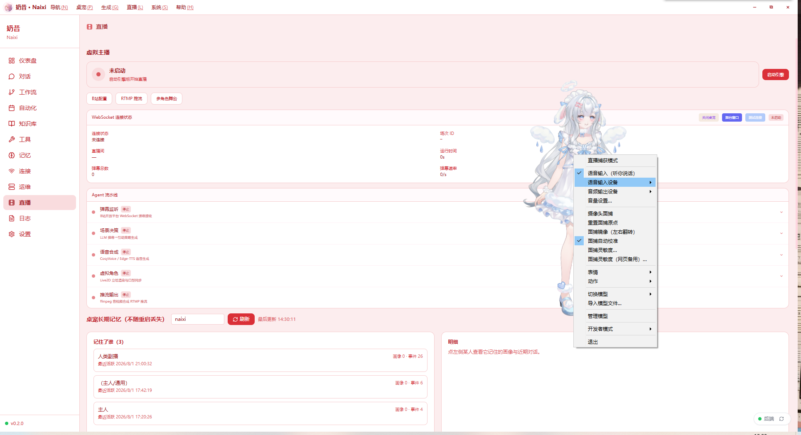
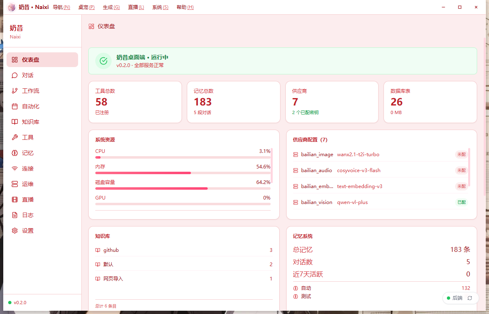
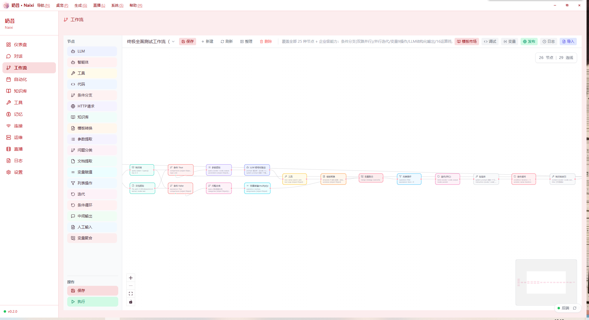
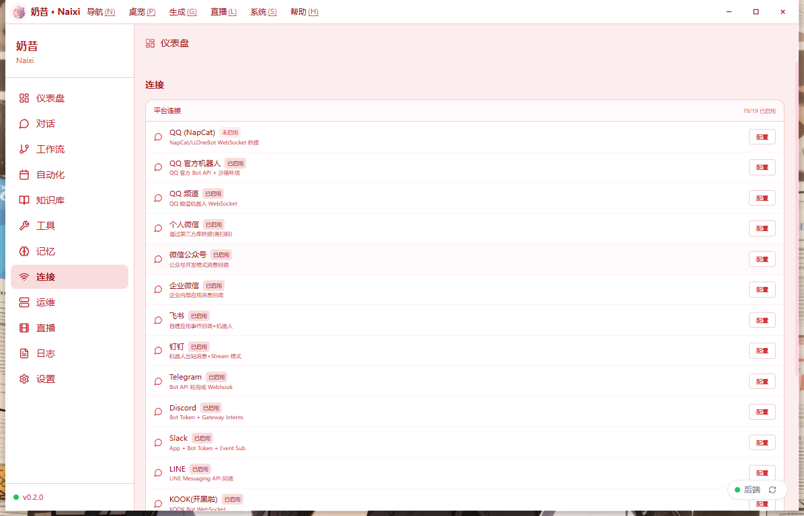
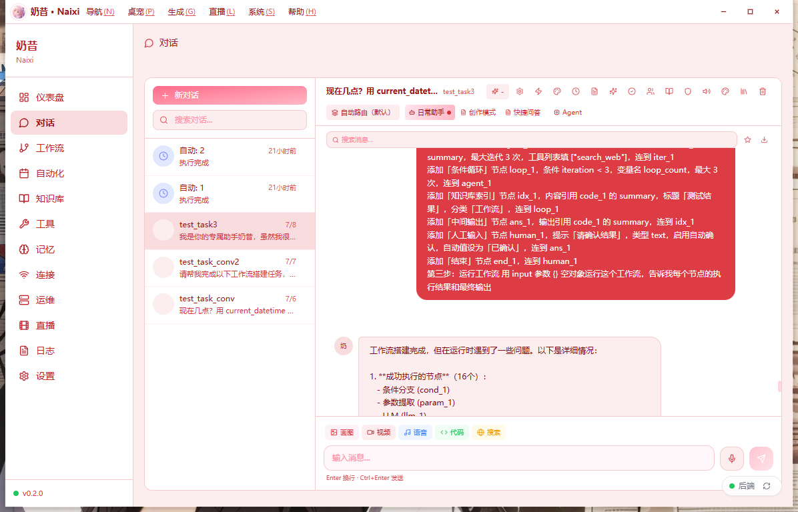
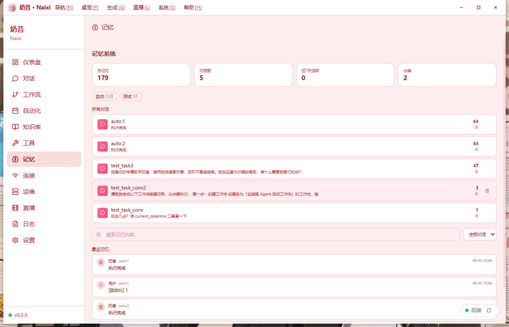
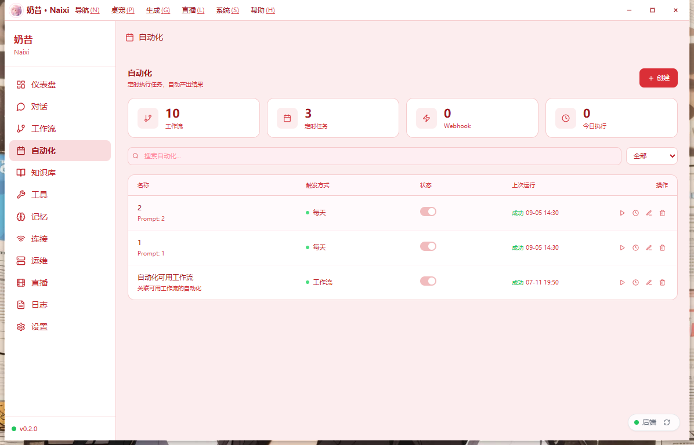
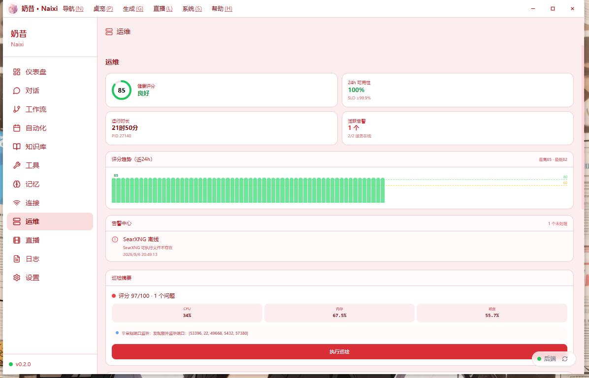
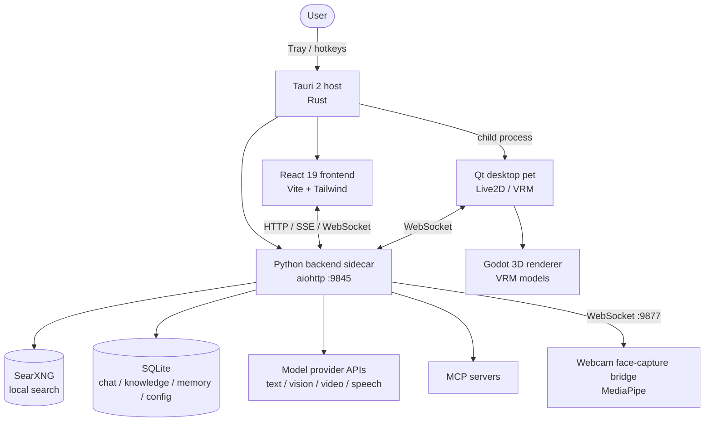

# Naixi Desktop — Local-First Desktop AI Agent

[简体中文](README.md) | English


> A **local-first** desktop AI agent built on Tauri 2. It lives in the system tray and folds chat, desktop pet,
> live-stream interaction, workflows, automation, local search, knowledge base and memory into one always-available
> app. Every model call, search request and speech process runs on-device or under your own account —
> **your data never leaves the machine**.

**Scale**: ~**48k** lines of first-party code (Python 33,508 / frontend 14,208 / Rust 467) · **52** Python modules ·
**35** frontend components · **176** REST APIs · **27** SQLite tables · **502** commits · Apache-2.0

| Layer | Tech |
| --- | --- |
| Shell | Tauri 2 (Rust), system-tray resident |
| Frontend | React 19 + Vite + Tailwind CSS |
| Backend | Python 3.13 sidecar (aiohttp, default `http://127.0.0.1:9845`) |
| Desktop pet | PySide6 (Qt) driving Live2D / VRM avatars, webcam face capture |
| Search | Bundled portable SearXNG, falls back to public engines |

## Screenshots

A few of the core views (full feature breakdown in [Features](#features)):

<table>
  <tr>
    <td width="50%"><br><sub><b>Desktop pet & live interaction</b> — Qt + Live2D avatar with danmaku, scenes and agent pipeline.</sub></td>
    <td width="50%"><br><sub><b>Dashboard</b> — tools, memory, providers, database and system resources at a glance.</sub></td>
  </tr>
  <tr>
    <td width="50%"><br><sub><b>Visual workflow editor</b> — drag-and-drop DAG with 25 node types (LLM, conditional, human input…).</sub></td>
    <td width="50%"><br><sub><b>19 platform integrations</b> — QQ, WeChat, Feishu, DingTalk, WeCom, Telegram, Discord, Slack, LINE…</sub></td>
  </tr>
  <tr>
    <td width="50%"><br><sub><b>Chat</b> — streaming, agent mode, shortcut answers and observable tool calls.</sub></td>
    <td width="50%"><br><sub><b>Layered memory</b> — short-term context plus long-term portraits with reflective consolidation.</sub></td>
  </tr>
  <tr>
    <td width="50%"><br><sub><b>Automation</b> — scheduled, webhook and workflow triggers with zero manual effort.</sub></td>
    <td width="50%"><br><sub><b>Ops & self-check</b> — health score, availability, trend chart, automated remediation.</sub></td>
  </tr>
</table>

---

## Contents

- [Engineering Highlights](#engineering-highlights)
- [Features](#features)
- [Architecture](#architecture)
- [Quick Start](#quick-start)
- [Build from Source](#build-from-source)
- [Configuration](#configuration)
- [FAQ](#faq)
- [Security & Integrity](#security--integrity)
- [License](#license)
- [Author](#author)

---

## Engineering Highlights

1. **Dual-process architecture.** The Tauri 2 (Rust) host owns windows, tray icon and child-process lifecycle; an
   independent Python sidecar owns all AI capabilities. The Rust side handles port pre-checks, process-tree reaping
   and embedded runtime discovery, so the frontend and backend can hot-reload independently and self-heal on failure.
2. **Four pluggable avatar backends.** One `AvatarBackend` interface (`send_expression` / `send_motion` /
   `send_parameters`) unifies in-house Live2D rendering, a VTube Studio connection pool, the VMC protocol over OSC
   and a plugin slot — driving Live2D, VRM, Pixi.js and Godot 3D pipelines interchangeably.
3. **System-level Windows work.** Transparent always-on-top overlay with pixel-accurate click-through via
   `WM_NCHITTEST`; solved the DWM composition-layer bug that rendered dialogs invisible (18 real-device iterations,
   visibility rate 0.8172 passed on the first attempt).
4. **LLM application engineering.** Models routed by task type (text / vision / video / code / speech) under
   per-model concurrency limits; layered memory with 3-level context compression, 46 tool calls and an MCP client;
   three-tier TTS failover (CosyVoice → Edge-TTS → offline kokoro-onnx).
5. **Game-playing agent (Cradle paradigm).** Screenshot in, keyboard and mouse out — no memory reading, no server
   connection; it only drives the user's own window. Includes post-action self-reflection that detects stuck states
   and forces recovery.
6. **User-mode security sentinel.** Emergency defense against the Silver Fox trojan (IOC sentinel scan, one-click
   remediation, installer SHA-256 self-check, periodic patrols) with **explicitly documented capability boundaries** —
   it does not claim to handle kernel-level rootkits.

---

## Features

**Chat & models** — streaming and agent chat with mid-flight cancellation; multi-model routing by task type; local
conversation history with per-session search; multimodal generation (image / video / voice / code).

**Desktop pet (PetWindow)** — Qt pet with Live2D and VRM avatars; a motion/Idle engine (head tilt, hair sway, body
float); webcam face capture via offline MediaPipe FaceLandmarker driving VRM expressions, head pose and Live2D
lip-sync (off by default); a 3D render adapter; and a multi-role stage where Pixi.js hosts N Live2D sprites routed by
`agent_id` with independent models, expressions, motions and lip-sync.

**Live interaction engine** — danmaku ingestion, voice broadcast, mic takeover (ASR → auto on-mic), scene switching;
VTube Studio multi-instance co-streaming with per-role ports; a live memory layer that remembers viewer profiles and
event streams.

**Voice** — mic capture + VAD (WebRTC / energy gate) + ASR (cloud and local channels) for input; unified TTS routing
(CosyVoice primary, Edge-TTS fallback) with one-click VoiceMeeter virtual audio routing for output.

**Knowledge base** — local entries with CRUD and semantic search; bulk import from GitHub repositories or web URLs
with automatic summarization and chunking.

**Memory system** — layered retrieval (short-term context + long-term portraits of users and viewers + recent event
streams) with a reflection module that periodically distills long-term memory.

**Resource library** — bundled experts, skills and prompts; pull community resources from GitHub; create your own.

**Workflows** — a visual DAG editor with rich node types; save / run / export / import / publish; Webhook triggers,
versioning and human-input nodes; publish as a service with API keys, usage stats and an online template market.

**Automation** — scheduled and event-triggered tasks composed of multiple steps (tools, chat, workflows), no manual
intervention.

**Ops & self-check** — ops dashboard (inspect, self-heal, incidents, maintenance mode, changelog, health trends); a
watchdog that restarts offline services; task management, run logs and automatic frontend error reporting.

**Tools & MCP** — a permission gate requiring user authorization before sensitive tool calls; MCP server management
(add / connect / disconnect / test, auto-connect on startup).

**Game agent** — screenshot in, keys and mouse out, driving the user's own single-player window. Supports Minecraft
(read-only mod injection + visual grounding), Mindustry (on-screen decisions) and Minesweeper.

**Security center** — user-mode emergency defense against Silver Fox: sentinel scanning for Defender exclusion
tampering, known IOC processes, suspicious scheduled tasks and C2 connections with safe / warn / danger triage;
one-click remediation; installer SHA-256 self-check; and background patrol alerts.

> **Capability boundary (important).** Recent Silver Fox variants load a `wnBios` kernel-mode rootkit via BYOVD that
> blinds Defender, Huorong and 360. **No user-mode program — Naixi included — can remove a kernel-level rootkit.**
> Naixi only handles user-mode traces and says so in the UI. It also ships **no** offensive capability against C2
> infrastructure: DoS or unauthorized access is both illegal and ineffective.

---

## Architecture



**Processes**

- **Main app (Tauri)** — windows, tray, installation, launches the backend and pet subprocesses.
- **Backend (Python)** — the single server for all AI capabilities, search, knowledge base, workflows and ops.
- **Desktop pet (Qt)** — optional Live2D / VRM avatar process, talks to the backend over WebSocket.
- **Face-capture bridge** — camera stream → MediaPipe → pose/expression data, on its own port.

---

## Quick Start

1. Download `奶昔_0.2.0_x64-setup.exe` from [Releases](../../releases).
2. Run the installer and follow the wizard (WebView2 runtime is installed automatically).
3. Launch "奶昔" from the Start menu or desktop shortcut.

> On an offline machine missing WebView2, the installer shows a Chinese manual-install prompt.

---

## Build from Source

Requirements: Windows 10+, Node.js 22+, Rust toolchain (cargo), Python 3.13.

```bash
npm install
npm run tauri build --bundles nsis
```

Output lands in `src-tauri/target/release/bundle/nsis/`.

> The build downloads and attaches a portable SearXNG (~154 MB) and a self-contained Python runtime, so a working
> network connection is required.

---

## Configuration

- **Model providers** — API keys are stored locally with Fernet encryption; the key is derived from a machine
  identifier and never written in plaintext. Providers and model policies are configured in the in-app settings.
- **Local search** — SearXNG starts with the app and degrades to public engines when offline.
- **MCP** — add server addresses in settings; configured servers auto-connect on startup.
- **Knowledge base / workflows / automation** — configured entirely from the UI; data lives in local `data/`.

Large or copyrighted assets are **not** distributed with the repo (VRM models exceed GitHub's 100 MB file limit and
involve game IP; the offline TTS model downloads on first use). Missing them does not affect chat, automation or any
other core capability.

---

## FAQ

**Are my API keys safe?**
They are encrypted at rest with Fernet using a machine-derived key — never stored in plaintext and never uploaded.

**Can I use it without a VRM model?**
Yes. VRM only affects 3D rendering; chat, automation, knowledge base, the Live2D pet and live streaming all work.

**Is the camera always on?**
No. Face capture is off by default and only starts when you enable it from the pet's right-click menu.

**Does the game agent read game memory or connect to servers?**
No. It uses screenshot-in / input-out, driving only your own current window. Nothing is read from the game's
internals and no server is contacted.

**Where is my data?**
All of it in the local `data/` directory (SQLite plus files). Nothing is uploaded.

---

## Security & Integrity

This project is distributed **only through GitHub Releases**. Any installer from a netdisk, forum, QQ group or
third-party site is **not official** — Silver Fox trojans frequently impersonate open-source installers.

Every release ships a `sha256sums.txt` (generated by `npm run gen:release-hashes`) with two groups of hashes:

```bash
sha256sum -c --ignore-missing sha256sums.txt
```

| Group | Verifies | When |
| --- | --- | --- |
| `[installer]` | the msi / setup.exe you downloaded | immediately after download |
| `[main binary]` | the installed `naixi-desktop.exe` | after installation |

For the second group: Settings → Security → copy the SHA-256 shown in-app and compare it against the
`[main binary]` section of the manifest. A mismatch means the local binary was replaced — reinstall from the official
release and run a full scan.

The app deliberately **exposes** the hash instead of auto-comparing it: a manifest shipped alongside a tampered
installer cannot be trusted, so the comparison has to be against GitHub Releases, by you.

The 0.2.0 installer is **not yet code-signed**, so Windows SmartScreen will report an unknown publisher. That is
expected, not tampering — and it is exactly why the two hash checks above matter.

Docs: [Release security policy](docs/RELEASE_SECURITY.md) ·
[VM sandbox hardening checklist](docs/VM_SANDBOX_HARDENING.md)

---

## License

Released under the [Apache License 2.0](LICENSE). Third-party component licenses are listed in [NOTICE](NOTICE).

---

## Author

Built and maintained independently by **Su Wan (苏婉)** — AI application engineer focused on LLM applications, desktop agents and multimodal systems.

- GitHub: [@Hayliy](https://github.com/Hayliy)
- Email: 2122235245@qq.com
- Open to **fully remote** roles (UTC+8).

If this project is useful to you, a star or a sponsorship is always welcome.
