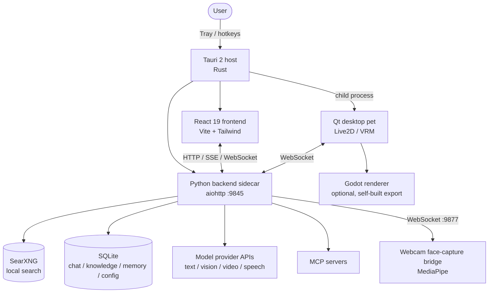

# Naixi Desktop — Local-First Desktop AI Agent

[简体中文](README.md) | English

[](https://github.com/Hayliy/naixi-desktop/actions/workflows/ci.yml)


> A **local-first** desktop AI agent built on Tauri 2. It lives in the system tray and folds chat, desktop pet,
> live-stream interaction, workflows, automation, local search, knowledge base and memory into one always-available
> app. Every model call, search request and speech process runs on-device or under your own account —
> **your data never leaves the machine**.

**Scale**: ~**52k** lines of first-party code (Python 36,490 / frontend 14,743 / Rust 477) · **55** Python modules ·
**38** frontend components · **182** REST endpoints · **28** SQLite tables · **575** commits · Apache-2.0

| Layer | Tech |
| --- | --- |
| Shell | Tauri 2 (Rust), system-tray resident |
| Frontend | React 19 + Vite + Tailwind CSS |
| Backend | Python 3.13 sidecar (aiohttp, default `http://127.0.0.1:9845`) |
| Desktop pet | PySide6 (Qt) driving Live2D / VRM avatars, webcam face capture |
| Search | Bundled portable SearXNG, falls back to public engines |

> This document mirrors the Chinese README ([README.md](README.md)), which is authoritative where the two differ.

## Screenshots

A few of the core views (full feature breakdown in [Features](#features)):

<table>
  <tr>
    <td width="50%"><br><sub><b>Desktop pet & live interaction</b> — Qt + Live2D avatar with danmaku, scenes and agent pipeline.</sub></td>
    <td width="50%"><br><sub><b>Dashboard</b> — tools, memory, providers, database and system resources at a glance.</sub></td>
  </tr>
  <tr>
    <td width="50%"><br><sub><b>Visual workflow editor</b> — drag-and-drop DAG with 25 node types (LLM, conditional, human input…).</sub></td>
    <td width="50%"><br><sub><b>Platform connectors</b> — QQ, Feishu, WeCom, DingTalk, Discord, Slack, Telegram, WhatsApp, email, GitHub, GitLab, custom HTTP.</sub></td>
  </tr>
  <tr>
    <td width="50%"><br><sub><b>Chat</b> — streaming, agent mode, shortcut answers and observable tool calls.</sub></td>
    <td width="50%"><br><sub><b>Layered memory</b> — short-term context plus long-term portraits with reflective consolidation.</sub></td>
  </tr>
  <tr>
    <td width="50%"><br><sub><b>Automation</b> — scheduled, webhook and workflow triggers with zero manual effort.</sub></td>
    <td width="50%"><br><sub><b>Ops & self-check</b> — health score, availability, trend chart, automated remediation.</sub></td>
  </tr>
</table>

---

## Contents

- [Engineering Highlights](#engineering-highlights)
- [Features](#features)
- [Architecture](#architecture)
- [Requirements](#requirements)
- [Quick Start](#quick-start)
- [Upgrade & Uninstall](#upgrade--uninstall)
- [Build from Source](#build-from-source)
- [Bundled vs. Bring-Your-Own Assets](#bundled-vs-bring-your-own-assets)
- [Configuration](#configuration)
- [Known Issues / Limitations](#known-issues--limitations)
- [Versioning & Compatibility](#versioning--compatibility)
- [FAQ](#faq)
- [Troubleshooting](#troubleshooting)
- [Security & Integrity](#security--integrity)
- [Risks & Compliance](#risks--compliance)
- [Sponsorship](#sponsorship)
- [License](#license)

---

## Engineering Highlights

1. **Dual-process architecture.** The Tauri 2 (Rust) host owns windows, tray icon and child-process lifecycle; an
   independent Python sidecar owns all AI capabilities. The Rust side handles port pre-checks, process-tree reaping
   and embedded runtime discovery, so the frontend and backend can hot-reload independently and self-heal on failure.
2. **Four pluggable avatar backends.** One `AvatarBackend` interface (`send_expression` / `send_motion` /
   `send_parameters`) unifies in-house Live2D rendering, a VTube Studio connection pool, the VMC protocol over OSC
   and a plugin slot — driving Live2D, three-vrm and Pixi.js pet pipelines plus a Godot render backend (Godot needs a
   self-built export, see [Bundled vs. Bring-Your-Own Assets](#bundled-vs-bring-your-own-assets)).
3. **System-level Windows work.** Transparent always-on-top overlay with pixel-accurate click-through via
   `WM_NCHITTEST`; solved the DWM composition-layer bug that rendered dialogs invisible (18 real-device iterations,
   visibility rate 0.8172 passed on the first attempt).
4. **LLM application engineering.** Models routed by task type (text / vision / video / code / speech) under
   per-model concurrency limits; layered memory with 3-level context compression, 46 tool calls and an MCP client;
   three-tier TTS failover (CosyVoice → Edge-TTS → offline kokoro-onnx).
5. **Game-playing agent (Cradle paradigm).** Screenshot in, keyboard and mouse out — no memory reading, no server
   connection; it only drives the user's own window. Includes post-action self-reflection that detects stuck states
   and forces recovery.
6. **User-mode security sentinel.** Emergency defense against the Silver Fox trojan (IOC sentinel scan, one-click
   remediation, installer SHA-256 self-check, periodic patrols) with **explicitly documented capability boundaries** —
   it does not claim to handle kernel-level rootkits.

---

## Features

**Chat & models** — streaming and agent chat with mid-flight cancellation; multi-model routing by task type; local
conversation history with per-session search; multimodal generation (image / video / voice / code).

**Desktop pet (PetWindow)** — Qt pet with Live2D and VRM avatars; a motion/Idle engine (head tilt, hair sway, body
float); webcam face capture via offline MediaPipe FaceLandmarker driving VRM expressions, head pose and Live2D
lip-sync (off by default); a 3D render adapter; and a multi-role stage where Pixi.js hosts N Live2D sprites routed by
`agent_id` with independent models, expressions, motions and lip-sync.

**Live interaction engine** — danmaku ingestion, voice broadcast, mic takeover (ASR → auto on-mic), scene switching;
VTube Studio multi-instance co-streaming with per-role ports; a live memory layer that remembers viewer profiles and
event streams.

**Voice** — mic capture + VAD (WebRTC / energy gate) + ASR (cloud and local channels) for input; unified TTS routing
(CosyVoice primary, Edge-TTS fallback) with one-click VoiceMeeter virtual audio routing for output.

**Knowledge base** — local entries with CRUD and semantic search; bulk import from GitHub repositories or web URLs
with automatic summarization and chunking.

**Memory system** — layered retrieval (short-term context + long-term portraits of users and viewers + recent event
streams) with a reflection module that periodically distills long-term memory.

**Resource library** — bundled experts, skills and prompts; pull community resources from GitHub; create your own.

**Workflows** — a visual DAG editor with rich node types; save / run / export / import / publish; Webhook triggers,
versioning and human-input nodes; publish as a service with API keys, usage stats and an online template market.

**Automation** — scheduled and event-triggered tasks composed of multiple steps (tools, chat, workflows), no manual
intervention.

**Ops & self-check** — ops dashboard (inspect, self-heal, incidents, maintenance mode, changelog, health trends); a
watchdog that restarts offline services; task management, run logs and automatic frontend error reporting.

**Diagnostics** — `GET /api/diagnostics` plus a "Run diagnostics" entry in the in-app **System** menu report backend
liveness, Python version, config and database schema versions, platform-connector count, configured providers and
platforms, live-engine state, a health score and the list of active degradations in one shot. This exists because
silent degradations (missing dependency, fallback path) used to be visible only in the logs.

**Tools & MCP** — a permission gate requiring user authorization before sensitive tool calls; MCP server management
(add / connect / disconnect / test, auto-connect on startup).

**Game agent** — screenshot in, keys and mouse out, driving the user's own single-player window. Supports Minecraft
(read-only mod injection + visual grounding), Mindustry (on-screen decisions) and Minesweeper.

**Security center** — user-mode emergency defense against Silver Fox: sentinel scanning for Defender exclusion
tampering, known IOC processes, suspicious scheduled tasks and C2 connections with safe / warn / danger triage;
one-click remediation; installer SHA-256 self-check; and background patrol alerts.

> **Capability boundary (important).** Recent Silver Fox variants load a `wnBios` kernel-mode rootkit via BYOVD that
> blinds Defender, Huorong and 360. **No user-mode program — Naixi included — can remove a kernel-level rootkit.**
> Naixi only handles user-mode traces and says so in the UI. It also ships **no** offensive capability against C2
> infrastructure: DoS or unauthorized access is both illegal and ineffective.

---

## Architecture



**Processes**

- **Main app (Tauri)** — windows, tray, installation, launches the backend and pet subprocesses.
- **Backend (Python)** — the single server for all AI capabilities, search, knowledge base, workflows and ops.
- **Desktop pet (Qt)** — optional Live2D / VRM avatar process, talks to the backend over WebSocket.
- **Face-capture bridge** — camera stream → MediaPipe → pose/expression data, on its own port.

---

## Requirements

| Item | Requirement |
| --- | --- |
| OS | Windows 10 1809 or later / Windows 11 (x64) |
| Runtime | WebView2 — installed automatically by the setup; offline machines get a manual-install prompt |
| Disk | about **1.3 GB** after installation (self-contained Python runtime plus bundled local search); 2 GB recommended |
| Memory | 4 GB or more recommended |
| Network | **Required**: model inference uses your own API keys (cloud). Chat history, knowledge base, desktop pet and local search all run on-device |
| Optional hardware | Microphone (voice input / live mic), webcam (face capture, off by default), NVIDIA GPU (GPU metrics on the dashboard) |

> The backend binds to `127.0.0.1:9845` only and exposes no external port. No telemetry, no usage upload. Per-host
> data flows are documented in [docs/PRIVACY.md](docs/PRIVACY.md) (Chinese).

---

## Quick Start

1. Download `naixi-desktop_1.0.0_x64-setup.exe` from [Releases](https://github.com/Hayliy/naixi-desktop/releases).
2. Run the installer and follow the wizard (WebView2 runtime is installed automatically).
3. Launch "奶昔" from the Start menu or desktop shortcut.

> On an offline machine missing WebView2, the installer shows a manual-install prompt (Chinese).

---

## Upgrade & Uninstall

**Upgrade** — download the new installer from [Releases](https://github.com/Hayliy/naixi-desktop/releases) and run it; it overwrites the previous
version in place. No need to uninstall first, and no need to reconfigure providers. The installer replaces program
files only (`desktop_core` / `python-embed` / `searxng` …) and does **not** touch your data (`data/` database and
`workspace/`). Copying `data/` beforehand is still a good habit.

**Uninstall** — Windows Settings → Apps → "奶昔" → Uninstall.

- **Your data is kept by default.** Only program files (`desktop_core` / `python-embed` / `searxng` / `plugins`),
  shortcuts and the registry entry are removed. `data/` (conversations, knowledge base, long-term memory, Fernet-
  encrypted API keys) and `workspace/` stay in place, and the final page tells you where they are.
- **Want it gone?** Tick "also delete my personal configuration and data (chat history, knowledge base, preferences)"
  on the confirmation page to also remove `data/`, `workspace/` and `%APPDATA%\奶昔`. It is **unchecked by default**.
- Versions 0.2.x and earlier had no such protection (they deleted the whole resource directory). This changed in 1.0.0.

> Quit Naixi (including the pet) before uninstalling. The GUI uninstaller terminates leftover processes; a silent
> command-line uninstall (`uninstall.exe /S`) does not, so running files may remain locked.

---

## Build from Source

Requirements: Windows 10+, Node.js 22+, Rust toolchain (cargo), Python 3.13.

```bash
npm install
npm run tauri build --bundles nsis
```

Output lands in `src-tauri/target/release/bundle/nsis/`.

> The build downloads and attaches a portable SearXNG (~108 MB) and a self-contained Python runtime, so a working
> network connection is required. `scripts/build-release.ps1` additionally performs signing, hash-manifest generation
> and the release gate (see [docs/CODE_SIGNING.md](docs/CODE_SIGNING.md), Chinese).

---

## Bundled vs. Bring-Your-Own Assets

These large or copyrighted assets are **not** distributed with the repo:

| Asset | Location | Notes |
| --- | --- | --- |
| VRM 3D model | `godot_renderer/scenes/` or `godot_renderer/models/` | Exceeds GitHub's 100 MB file limit and involves game IP; missing it does not affect chat or automation |
| Godot export `NaixiVRM.exe` | `godot_renderer/export/` | Project source is in-repo, but the export must be built with Godot 4.7; without it the "VMC → Godot" backend is unavailable (Live2D and three-vrm pets are unaffected) |
| Local TTS model (kokoro-onnx) | `naixi_tts_models/` (auto-generated) | Downloaded on first use |
| Minecraft client/server | `mc_test/` (git-ignored) | Only for game-agent self-verification; contains third-party copyrighted files |

---

## Configuration

- **Model providers** — API keys are stored locally with Fernet encryption; the key is derived from a machine
  identifier and never written in plaintext. Providers and model policies are configured in the in-app settings.
- **Local search** — SearXNG starts with the app and degrades to public engines when offline.
- **MCP** — add server addresses in settings; configured servers auto-connect on startup.
- **Knowledge base / workflows / automation** — configured entirely from the UI; data lives in local `data/`.

---

## Known Issues / Limitations

The honest boundary of 1.0.0:

- **Code signing is self-signed.** The installer carries a valid Authenticode signature, but a self-signed root is not
  trusted by Windows, so SmartScreen still warns about an unknown publisher. That is expected, not tampering. What the
  signature does buy you is verifiable integrity and a stable signing identity you can compare. **Hash verification
  below is therefore still required.**
- **NSIS only, no MSI.** `bundle.targets` is `["nsis"]`: the WiX (MSI) template was never updated for the 7z resource
  bundle and produces an install with no `desktop_core`, so the backend cannot start.
- **VRM models and the Godot export are not shipped** — see [Bundled vs. Bring-Your-Own Assets](#bundled-vs-bring-your-own-assets).
- **Offline TTS fallback is low quality.** Of the three TTS tiers, local kokoro-onnx is noticeably weaker than cloud
  voices and exists only as an offline fallback.
- **The game agent is experimental.** Desktop-pet-style screenshot-in/input-out control depends on OCR and visual
  grounding; complex or fast-moving scenes get stuck. Not production-ready.
- **Large assets are downloaded at build time** (self-contained Python runtime and SearXNG, ~108 MB).
- **No backend hot reload.** After editing `desktop_core/`, restart the app.
- **Silent uninstall does not terminate leftover processes.** The GUI uninstaller ends the pet and backend first;
  `uninstall.exe /S` does not. Your data is still preserved as described above.

---

## Versioning & Compatibility

- **Stability.** Starting with `1.0.0` the project is in a stable phase. **Backward compatibility of user data is a
  hard commitment**: any breaking change to the local SQLite schema or config files must ship a migration.
- **User-data contract.** Database and config schemas are protected by versioned migrations, so upgrades do not lose
  data and do not overwrite configuration.
- **Config merge semantics.** Masked or empty values sent back by the frontend never clear the real encrypted value
  stored locally.
- **Internal API is not a public contract.** The REST API binds to `127.0.0.1` for the in-app frontend only and may
  change between versions.
- **SemVer.** After `1.0.0`: MAJOR = breaking data/schema change, MINOR = backward-compatible features, PATCH = fixes.

---

## FAQ

**Are my API keys safe?**
They are encrypted at rest with Fernet using a machine-derived key — never stored in plaintext and never uploaded.

**Can I use it without a VRM model?**
Yes. VRM only affects 3D rendering; chat, automation, knowledge base, the Live2D pet and live streaming all work.

**Is the camera always on?**
No. Face capture is off by default and only starts when you enable it from the pet's right-click menu.

**Does the game agent read game memory or connect to servers?**
No. It uses screenshot-in / input-out, driving only your own current window. Nothing is read from the game's
internals and no server is contacted.

**Where is my data?**
All of it in the local `data/` directory (SQLite plus files). Nothing is uploaded.

**How do I check whether the install is healthy?**
Open the **System** menu in the top bar and click "Run diagnostics" (`GET /api/diagnostics`). It reports backend
liveness, schema versions, connector count and any active degradations.

---

## Troubleshooting

For "no sound / no reaction / wrong display" symptoms, see [docs/TROUBLESHOOTING.md](docs/TROUBLESHOOTING.md)
(Chinese). It covers the verified high-frequency causes: the three root causes of silent TTS, dual-channel TTS config
mismatch, face capture being off by default, SearXNG degradation and SmartScreen false positives.

---

## Security & Integrity

This project is distributed **only through GitHub Releases**. Any installer from a netdisk, forum, QQ group or
third-party site is **not official** — Silver Fox trojans frequently impersonate open-source installers.

Every release ships a `SHA256SUMS.txt` (generated by `npm run gen:release-hashes`) with two groups of hashes:

```bash
sha256sum -c --ignore-missing SHA256SUMS.txt
```

| Group | Verifies | When |
| --- | --- | --- |
| `[installer]` | the setup.exe you downloaded | immediately after download |
| `[main binary]` | the installed `naixi-desktop.exe` | after installation |

For the second group: Settings → Security → copy the SHA-256 shown in-app and compare it against the
`[main binary]` section of the manifest. A mismatch means the local binary was replaced — reinstall from the official
release and run a full scan.

The app deliberately **exposes** the hash instead of auto-comparing it: a manifest shipped alongside a tampered
installer cannot be trusted, so the comparison has to be against GitHub Releases, by you.

**Code signing.** The 1.0.0 installer uses a **self-signed certificate** (no trusted-CA OV/EV certificate yet), so
SmartScreen still warns about an unknown publisher. This is expected. Verification:

1. Download `naixi-selfsign.cer` from the release and import it into "Trusted Root Certification Authorities" (or just
   compare the thumbprint);
2. Right-click the installer → Properties → **Digital Signatures** to compare subject and thumbprint with the release
   notes;
3. Or run `Get-AuthenticodeSignature .\naixi-desktop_<version>_x64-setup.exe | Format-List Status,SignerCertificate`.

The signing and certificate-swap workflow is documented in [docs/CODE_SIGNING.md](docs/CODE_SIGNING.md) (Chinese).

**Analyzing samples in a VM.** Before running Silver Fox samples in a VM to evaluate this program, read
[docs/VM_SANDBOX_HARDENING.md](docs/VM_SANDBOX_HARDENING.md) (Chinese). Assume the guest is 100% compromised: the
malware carries a BYOVD kernel rootkit that blinds in-guest AV, so safety rests on the hypervisor and network gates.

Related docs: [Release security policy](docs/RELEASE_SECURITY.md) ·
[Privacy and data flows](docs/PRIVACY.md) ·
[Third-party licenses](THIRD_PARTY_LICENSES.md) (all Chinese).

---

## Risks & Compliance

Some capabilities depend on third-party platforms and unofficial interfaces:

- **Multi-platform messaging (12 connectors).** QQ is integrated through an **unofficial protocol** (NapCat /
  LLOneBot), which risks platform restrictions, risk-control actions or account bans. Feishu, WeCom, DingTalk,
  Discord, Slack, Telegram and WhatsApp use their official bot APIs or webhooks; GitHub, GitLab, email and custom HTTP
  trigger workflows. This project has **no partnership** with any of these platforms.
- **Game agent.** Injecting keyboard and mouse input may be flagged as cheating by anti-cheat in online or competitive
  games. Use it only for single-player games or scenarios that explicitly allow automation. **Never in online
  competitive titles.**
- **Security center.** Sentinel scans and remediation terminate processes, delete scheduled tasks and modify Defender
  exclusions, which may be flagged by other security software.
- **Live streaming.** Depends on third-party platform interfaces that may change without notice.
- **Self-signed installer.** SmartScreen warnings are expected; complete the hash checks above regardless.

---

## Sponsorship

If this project helps you, sponsorship is welcome (WeChat / Alipay — GitHub Sponsors is unavailable in mainland
China). Open the app → Settings → About → "Sponsorship" and scan. The payment QR codes are pinned by SHA-256 inside
the app with an integrity check, and the recipient's real name is displayed for comparison; if the integrity check
fails, the installer may have been tampered with and should be re-downloaded from Releases only.

---

## License

Released under the [Apache License 2.0](LICENSE). Third-party component licenses are listed in [NOTICE](NOTICE) and
[THIRD_PARTY_LICENSES.md](THIRD_PARTY_LICENSES.md).

---

## Author

Built and maintained independently by **Su Wan (苏婉)** — AI application engineer focused on LLM applications, desktop agents and multimodal systems.

- GitHub: [@Hayliy](https://github.com/Hayliy)
- Email: 2122235245@qq.com
- Open to **fully remote** roles (UTC+8).

If this project is useful to you, a star or a sponsorship is always welcome.
